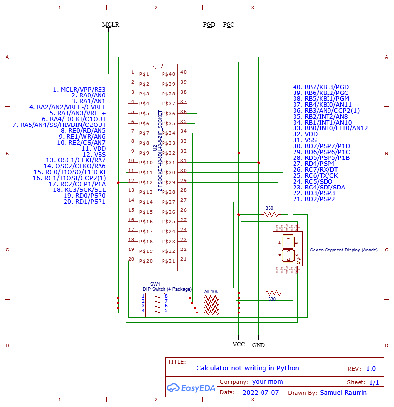

# Lab 5
[Lab 5 Youtube Link](https://youtu.be/0aZgKs1IrdE)

## Notes
- Used a common anode display
- I redid the hex values for the display, since I was too lazy to swap the pins after rewiring twice lol
- At this point, I learn that 330 ohms is kinda high for the switches, so I *switched* to 10k

Lab 5 Schematic
 